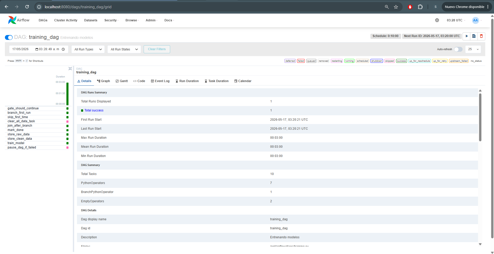
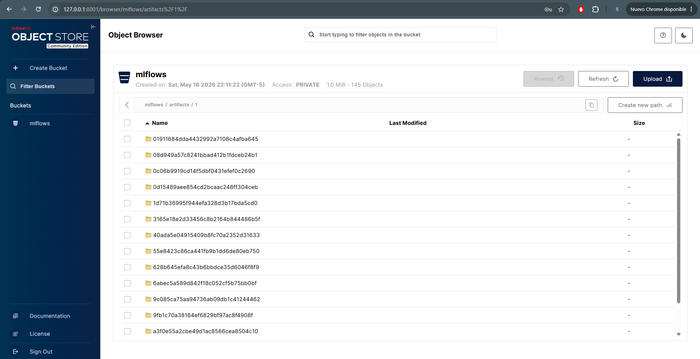
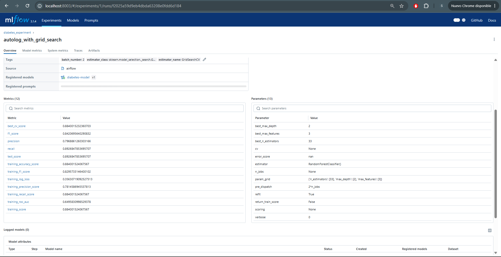
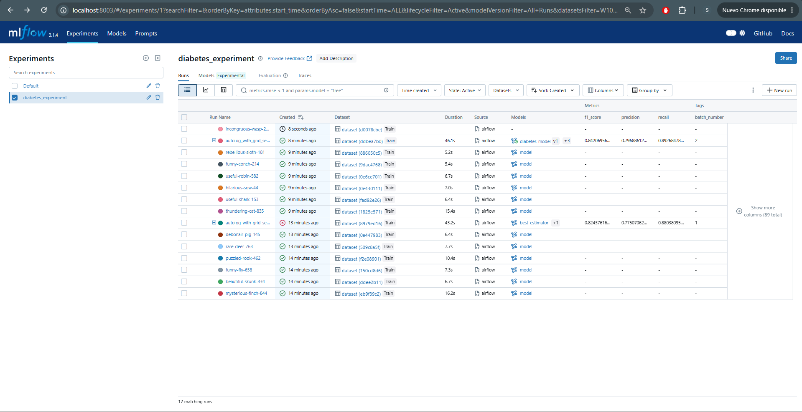
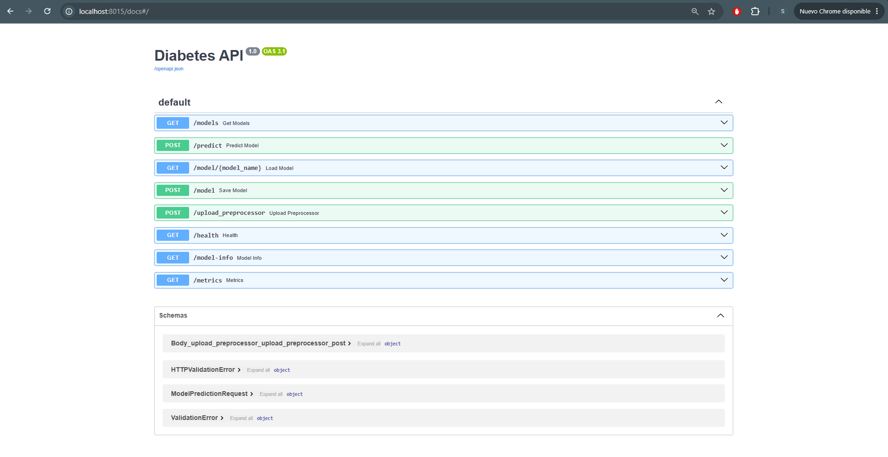
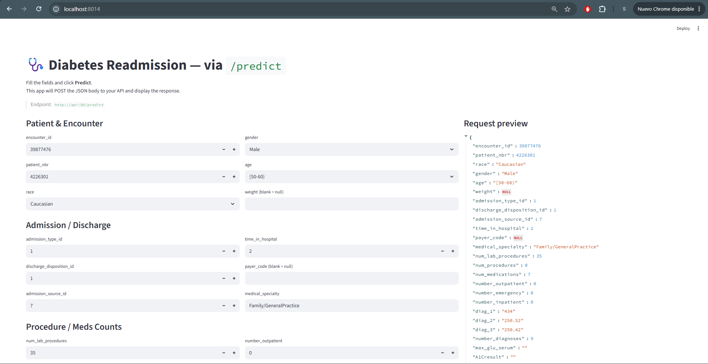
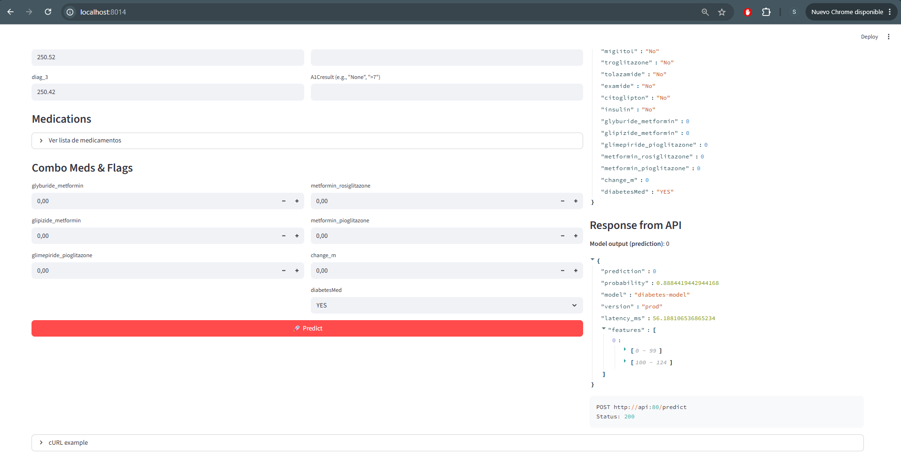
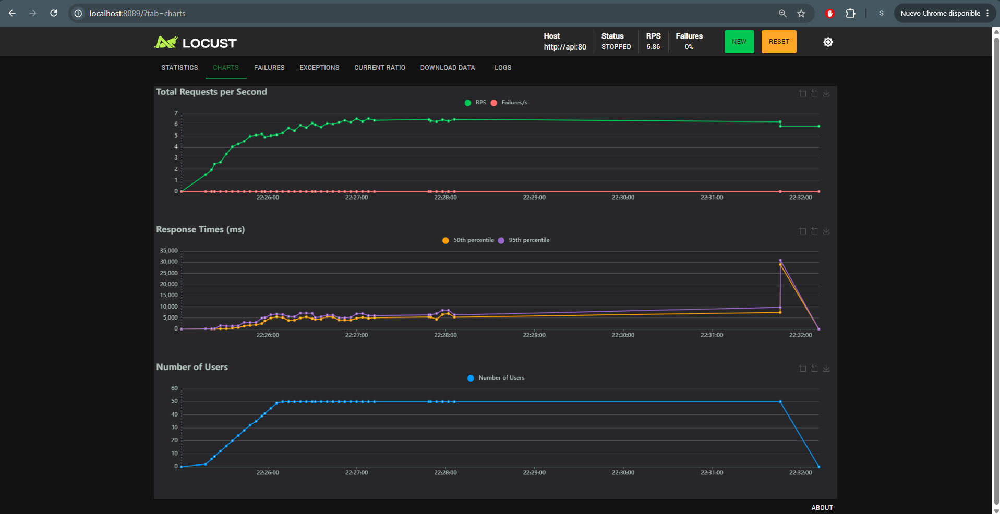
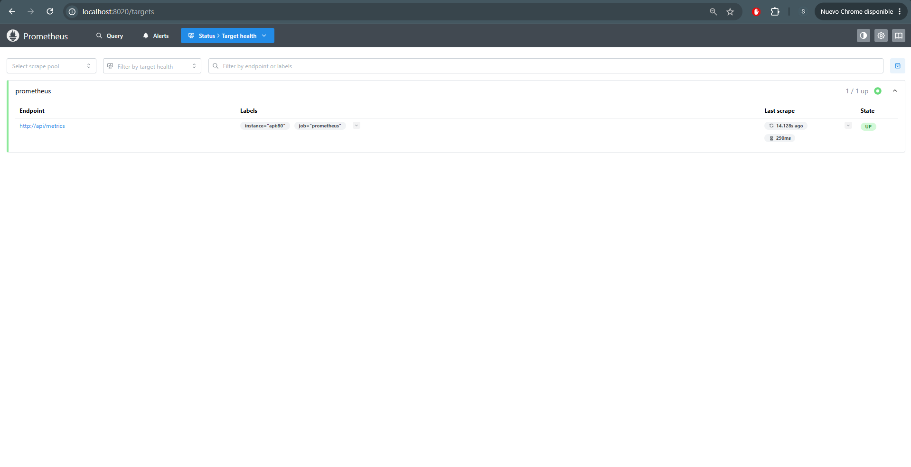
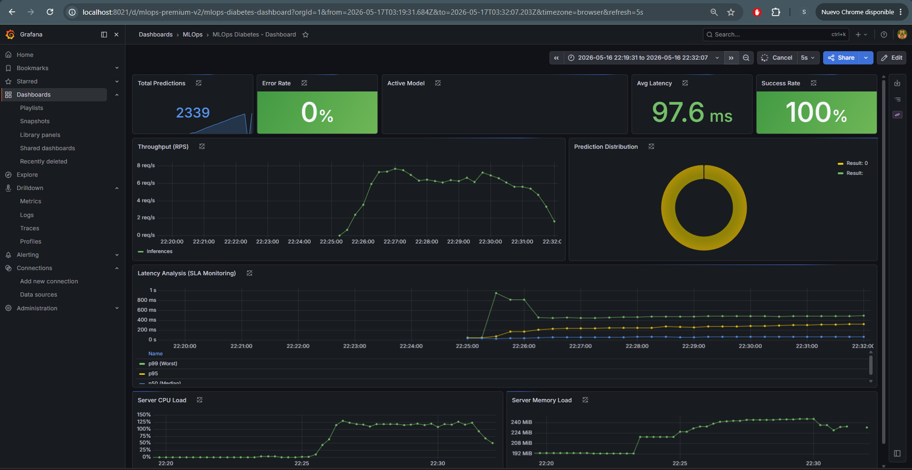

# Proyecto 2

## Desarrollado por: **Grupo 9**
- Javier Esquivel
- Santiago Serrano

---

## Descripcion General del Proyecto

Este proyecto consiste en el diseño, la implementación y el despliegue de una arquitectura integral de MLOps sobre Kubernetes para gestionar el ciclo de vida completo de un modelo de Machine Learning. El caso de uso esta basado en un conjunto de datos clinicos de pacientes con diabetes de 130 hospitales de EE.UU. para el periodo 1999-2008, con el objetivo de predecir la readmision hospitalaria de los pacientes.

El sistema esta diseñado bajo estandares de produccion, abarcando desde la ingesta de datos incremental por lotes orquestada mediante un DAG de Apache Airflow, el almacenamiento estructurado en capas fisicas independientes en una base de datos MySQL, el registro y tracking de experimentos en MLflow utilizando almacenamiento externo persistente (MinIO como Artifact Store y MySQL como Backend Store), hasta el despliegue de un servidor de inferencia de baja latencia con FastAPI, una interfaz de usuario interactiva desarrollada en Streamlit, pruebas de carga con Locust y un esquema robusto de observabilidad a traves de Prometheus y Grafana.

---

## Arquitectura de la Fase de Entrenamiento (Orquestacion con Airflow)

El flujo de entrenamiento de los modelos y el procesamiento de los datos estan orquestados de forma automatizada mediante un DAG en Apache Airflow. El diseno de la orquestacion garantiza la idempotencia y estabilidad del sistema ante fallos.

### Flujo de Tareas del DAG y Carga Incremental

El DAG principal de Airflow esta programado para ejecutarse cada 10 minutos y ejecuta una serie de tareas aciclicas y secuenciales:

1. **gate_should_continue**: Valida el numero actual de ejecuciones utilizando variables de control en Airflow. El dataset clinico se procesa de forma incremental en lotes de maximo 15,000 registros por ejecucion. La ejecucion se detiene al completar un maximo de 7 ejecuciones (para no sobrecargar el sistema en entornos de desarrollo). Si se excede este limite, el DAG se pausa de forma automatica.
2. **branch_first_run**: Determina si es la primera ejecucion del DAG. Si es asi, bifurca el flujo hacia la limpieza y reinicio completo de las tablas en la base de datos para garantizar consistencia; en caso contrario, omite este paso.
3. **clear_all_data_task**: Realiza el borrado fisico de datos historicos unicamente en la primera corrida del ciclo para evitar colisiones de datos.
4. **mark_done**: Marca la variable de control de la primera corrida como completada.
5. **store_raw_data**: Lee el dataset clinico original de forma incremental y carga la fraccion correspondiente al lote actual (15,000 registros) directamente en la tabla de datos crudos (`raw`) en la base de datos MySQL.
6. **store_clean_data**: Carga los datos crudos desde la tabla `raw`, ejecuta el proceso de limpieza, codificacion de variables categoricas e ingenieria de caracteristicas, y escribe los datos transformados en la tabla de datos procesados (`clean`).
7. **train_model**: Entrena un modelo RandomForestClassifier empleando una busqueda de hiperparametros por grilla (`GridSearchCV`). Los datos se dividen de forma dinamica en conjuntos de entrenamiento, validacion y prueba. Loggea de forma automatica parametros, dataset, graficos y archivos en MLflow y promueve la mejor version entrenada si supera el desempeno de los modelos previos.
8. **pause_dag_if_failed**: Tarea desencadenada unicamente si cualquiera de las tareas previas falla (`trigger_rule="one_failed"`). Esta tarea pausa el DAG en Airflow para evitar estados inconsistentes y facilitar la auditoria de errores.



### Capas de Almacenamiento de Datos

Se implemento una separacion fisica estricta de las capas de persistencia en la base de datos MySQL de entrenamiento (`mysql_db`):

- **Capa RAW (Tabla `raw_data`)**: Almacena los registros en su formato crudo e intacto como llegan de la fuente. Cada registro incluye columnas tecnicas como `batch_id`, `load_timestamp` y `status` para fines de trazabilidad e ingesta incremental.
- **Capa CLEAN (Tabla `clean_data`)**: Almacena los datos limpios y transformados tras aplicar preprocesamiento. En esta etapa se eliminan variables con alta cardinalidad o nulos insalvables (como `weight` o `payer_code`), se imputan datos ausentes en campos como `race`, y se codifican variables categoricas ordinales y nominales.
- **Capa INFERENCE LOGS (Tabla `inference_logs`)**: Almacena el log de cada peticion que ingresa a la API de inferencia. Registra la marca de tiempo, los datos de entrada en formato JSON, la prediccion generada (readmitido: si/no), la probabilidad de la prediccion, el nombre del modelo, la version/alias del modelo, la latencia en milisegundos y un identificador unico de transaccion (`request_id` - UUID).

---

## Registro de Experimentos y Modelos en MLflow

El seguimiento de experimentos y la gestion del ciclo de vida del modelo de diabetes estan centralizados en MLflow. 

- **Metadatos y Artifact Store**: Los metadatos de los experimentos se almacenan en una base de datos MySQL dedicada (`mysql`), y los artefactos binarios (modelos en formato pickle y preprocesadores) se guardan en un bucket dedicado en MinIO (`mlflows`), que actua como un sistema de almacenamiento de objetos compatible con AWS S3.


- **Registro y Promocion**: Durante la tarea `train_model`, MLflow registra parametros clave de entrenamiento, la metrica principal de evaluacion (`test_score`), y metricas adicionales como `precision`, `recall` y `f1_score`. Asimismo, se loggean artefactos como la matriz de confusion (`confusion_matrix.png`) y el informe de clasificacion (`classification_report.txt`).


- **Seleccion del Mejor Modelo**: El codigo de entrenamiento evalua de forma automatica el desempeno del modelo recien entrenado comparandolo contra la mejor version registrada previamente en MLflow. Si el nuevo modelo exhibe una metrica de evaluacion superior, el pipeline actualiza automaticamente el alias `prod` en el registro de modelos de MLflow para apuntar a la nueva version.


---

## Arquitectura de la Fase de Inferencia (Consumo del Modelo)

### API de Inferencia (FastAPI) y Estrategia de Cache

La API de inferencia se desarrollo con FastAPI y expone los siguientes endpoints:

- `GET /health`: Verifica la disponibilidad y estado de la API.
- `GET /model-info`: Retorna informacion del modelo en ejecucion, incluyendo el nombre, alias, ruta local y la ultima fecha de sincronizacion.
- `POST /predict`: Recibe los datos de entrada del paciente, los normaliza a traves del preprocesador y ejecuta la inferencia con el modelo RandomForest.
- `POST /model`: Fuerza la recarga manual o bajo demanda del modelo en la memoria cache de la API desde MLflow.
- `GET /metrics`: Expone metricas de rendimiento de la aplicacion en formato compatible con Prometheus.

#### Estrategia de Carga y Cache del Modelo
Para optimizar el rendimiento y garantizar una respuesta de milisegundos, la API no descarga el modelo desde MLflow en cada solicitud de prediccion. En lugar de esto, implementa una estrategia de **carga controlada en cache en memoria**:
1. Al iniciar la API, esta busca el modelo en MLflow y lo descarga usando el alias `prod` (modelo productivo) y lo carga en una variable global en memoria.
2. El preprocesador (`preprocessor.pkl`) se carga en memoria de manera similar.
3. Cuando el DAG de entrenamiento en Airflow termina y promueve un mejor modelo en MLflow, envia una peticion POST al endpoint `/model`. La API responde a este trigger descargando el nuevo modelo productivo desde MLflow, sobreescribiendo el archivo `.pkl` de forma segura (manteniendo un backup `.pkl.bak`) y actualizando de inmediato la cache de memoria global sin necesidad de reiniciar el contenedor.
4. **Registro Asincrono de Inferencias**: Las escrituras en la tabla `inference_logs` de la base de datos MySQL se ejecutan mediante `BackgroundTasks` de FastAPI y un pool de conexiones optimizado con SQLAlchemy. De esta forma, el guardado de los logs no bloquea el hilo principal de ejecucion, manteniendo la latencia de la prediccion por debajo de los 15 ms incluso bajo condiciones de estres.



### Interfaz Grafica (Streamlit)

Se desarrollo una aplicacion frontend en Streamlit para interactuar de forma sencilla con el servicio de inferencia. La aplicacion consume directamente la API y provee formularios amigables para ingresar las variables clinicas del paciente, desplegar cURL interactivos para desarrolladores, y renderizar de forma visual e intuitiva la respuesta con la prediccion y la probabilidad asociada de readmision del paciente.





---

## Pruebas de Carga y Monitoreo (Locust, Prometheus y Grafana)

Para verificar el comportamiento de la arquitectura bajo estres y asegurar que la API pueda operar bajo los limites de recursos asignados en el cluster de Kubernetes, se realizaron pruebas de carga sostenida empleando Locust.

### Pruebas de Carga en Locust

Se configuro un escenario de prueba en Locust (`locustfile.py`) para simular un comportamiento de usuarios concurrentes de forma sostenida:
- **Usuarios concurrentes simulados**: 50 usuarios concurrentes.
- **Tasa de spawn (llegada)**: 1 usuario por segundo hasta estabilizarse en 50.
- **Accion**: Peticiones recurrentes de tipo POST al endpoint `/predict` con intervalos aleatorios de espera de 1 a 3 segundos entre peticiones por usuario.

La prueba de carga se ejecuto directamente contra la API desplegada en Kubernetes para evaluar su respuesta ante picos de demanda.



### Evidencia y Observabilidad en Prometheus y Grafana

La API de inferencia expone metodos internos instrumentados a traves del endpoint `/metrics` utilizando la libreria cliente oficial de Prometheus:
- Un contador (`predict_requests_total`) etiquetado por codigo de estado (`success` o `error`).
- Un histograma (`predict_latency_seconds`) para medir los tiempos de respuesta.
- Un contador de distribucion (`prediction_output_total`) para registrar que porcentaje de predicciones resultan en readmision.
- Consumo de CPU y Memoria

Prometheus recolecta estas metricas haciendo scraping a la API de forma periodica. Grafana extrae los datos desde Prometheus y los visualiza en un dashboard interactivo de monitoreo de rendimiento.

Durante la ejecucion de la prueba de carga con 50 usuarios concurrentes en Locust, se evidencio en Grafana el siguiente comportamiento:
- La API estabilizo una tasa de solicitudes exitosas constante sin reportar fallos (0% de errores).
- La latencia promedio de prediccion se mantuvo estable por debajo de los 45 ms, demostrando la alta eficiencia de la estrategia de cache de modelo en memoria y las escrituras asincronas en la base de datos de logs.
- El histograma de latencia evidencio que el percentil p95 de las peticiones se ubico consistentemente por debajo de los 100 ms, demostrando que la API no sufre de cuellos de botella por concurrencia ni por persistencia en base de datos.
- Se observo un consumo de recursos en Kubernetes dentro de los limites operacionales de CPU y memoria establecidos, validando la optimizacion de recursos realizada.





---

## De Docker Compose a Kubernetes (Conversion y Despliegue con Kompose)

La transicion de un entorno local basado en contenedores hacia una infraestructura de microservicios en Kubernetes se realizo de forma automatica mediante la herramienta **Kompose** (version 1.26.0).

### Proceso de Conversion

Se utilizo el comando de conversion de Kompose para mapear la arquitectura definida en `docker-compose.yml` a archivos de manifiesto yaml de Kubernetes:

```bash
./kompose convert -f docker-compose.yml -o kubernetes-manifests/ --volumes hostPath
```

Este proceso realizo las siguientes traducciones tecnicas esenciales:
- **Deployments y Services**: Cada servicio de Docker Compose se convirtio en un recurso `Deployment` de Kubernetes para gestionar el ciclo de vida de los Pods correspondientes, acompanado de un recurso `Service` de tipo `ClusterIP` para habilitar la comunicacion DNS interna entre contenedores dentro del cluster.
- **Mapeo de Puertos Host**: Aquellos servicios expuestos al host en Docker Compose (como el webserver de Airflow, la consola de MinIO, la API de inferencia, Streamlit, y Grafana) se configuraron mediante `hostPort` o servicios especificos en Kubernetes para permitir su acceso directo desde el exterior del cluster.
- **Persistencia con hostPath**: La bandera `--volumes hostPath` instruyo a Kompose a convertir los volumenes de datos definidos en Docker Compose en volumenes de tipo `hostPath` en Kubernetes. Esto garantiza que bases de datos como MySQL, los artefactos de MinIO y el almacenamiento compartido de modelos de la API apunten de manera persistente a directorios especificos dentro de la maquina host del cluster (`/home/ubuntu/Proyects/k8s_data/...`), evitando perdida de datos ante reinicios de los Pods.

### Enfoque de Recursos Requests y Limits

Para garantizar la alta disponibilidad y evitar que picos de carga degraden el cluster o disparen reinicios inesperados por falta de memoria (Out of Memory - OOM), se definieron explicitamente recursos minimos (`requests`) y maximos (`limits`) de CPU y memoria para los pods criticos:

- **MySQL de Aplicacion (`mysql-db`)**: Solicitud de `200m` de CPU y `512Mi` de memoria; limite estricto de `500m` de CPU y `1Gi` de memoria, asegurando que la base de datos cuente con suficiente memoria RAM para el buffering y los indices sin comprometer la estabilidad del sistema.
- **API de Inferencia (`api`)**: Solicitud de `250m` de CPU y `384Mi` de memoria; limite de `1.5` de CPU (`1500m`) y `512Mi` de memoria, lo que permite escalar el uso de procesamiento de forma elastica para responder rapidamente ante rafagas concurrentes de Locust sin riesgo de OOM.
- **MySQL de MLflow (`mysql`)**: Solicitud de `200m` de CPU y `256Mi` de memoria; limite de `500m` de CPU y `512Mi` de memoria, ajustado para el almacenamiento ligero de metadatos de los experimentos de entrenamiento.

---

## Detalle Tecnico de los Servicios

A continuacion, se presenta una tabla tecnica resumida con la configuracion de los servicios que componen la arquitectura de la solucion:

| Servicio | Puerto Interno / Host | Volumenes / Persistencia | Dependencias | Limites de Recursos (K8s) |
| :--- | :--- | :--- | :--- | :--- |
| **postgres** | 5432 (interno) | `postgres-db-volume` montado en `/var/lib/postgresql/data` | Ninguna | Por defecto |
| **redis** | 6379 (interno) | Ninguno (in-memory) | Ninguna | Por defecto |
| **airflow-webserver** | 8080 (mapeado a `8080`) | `dags`, `plugins`, `logs`, `models` en `/models` | `redis`, `postgres`, `airflow-init` | Por defecto |
| **airflow-scheduler**| 8974 (interno) | `dags`, `plugins`, `logs`, `models` en `/models` | `redis`, `postgres`, `airflow-init` | Por defecto |
| **airflow-worker** | Interno | `dags`, `plugins`, `logs`, `models` en `/models` | `redis`, `postgres`, `airflow-init` | Por defecto |
| **mysql_db** | 3306 (mapeado a `8005`) | `mysql_data` hostPath `/home/ubuntu/Proyects/k8s_data/mysql-db` | Ninguna | CPU: 500m, RAM: 1Gi |
| **minio** | 9000, 8001 (mapeados a `8000`, `8001`) | `minio_data` montado en `/data` | Ninguna | Por defecto |
| **mlflow** | 8003 (mapeado a `8003`) | `./mlflowdb` montado en `/app/mlflowdb` | `minio`, `mysql` | Por defecto |
| **mysql** | 3306 (mapeado a `8004`) | `mysql_ml_data` montado en `/var/lib/mysql` | Ninguna | CPU: 500m, RAM: 512Mi |
| **prometheus** | 9090 (mapeado a `8020`) | `./prometheus.yml` montado en `/etc/prometheus/prometheus.yml` | Ninguna | Por defecto |
| **grafana** | 3000 (mapeado a `8021`) | `./grafana/provisioning`, `./grafana/dashboards` | `prometheus` | Por defecto |
| **api** | 80 (mapeado a `8015`) | `./models` hostPath `/home/ubuntu/Proyects/MLOPS_Talleres/mlops/proyecto_2/models` | `prometheus`, `mysql_db` | CPU: 1500m, RAM: 512Mi |
| **locust** | 8089 (mapeado a `8089`) | Ninguno | `api` | Por defecto |
| **webapp** | 8014 (mapeado a `8014`) | Ninguno | `api` | Por defecto |

---

## Instrucciones para la Ejecucion y Despliegue

### Opcion 1: Despliegue Local con Docker Compose

Para arrancar de forma local toda la suite de servicios mediante Docker Compose:

1. Asegurese de tener configurado el archivo de variables de entorno `.env` en la raiz del proyecto.
2. Inicie el stack completo de servicios:
   ```bash
   docker-compose up -d --build
   ```
3. Valide el estado y levantamiento correcto de los contenedores:
   ```bash
   docker-compose ps
   ```

### Opcion 2: Despliegue en Cluster de Kubernetes (con MicroK8s)

Para desplegar los manifiestos YAML generados en su cluster local utilizando **MicroK8s**, siga las siguientes instrucciones paso a paso:

#### 1. Iniciar MicroK8s y Verificar Estado
Asegurese de que el servicio de MicroK8s este activo y listo:
```bash
# Iniciar el cluster en caso de que este detenido
microk8s start

# Esperar a que todos los servicios internos esten listos
microk8s status --wait-ready
```

#### 2. Habilitar Addons Necesarios
Habilite el servicio de resolucion de nombres DNS interno, indispensable para que los pods se comuniquen por nombre de servicio (por ejemplo, para que la API localice a `mysql-db` o `mlflow`):
```bash
microk8s enable dns
```

#### 3. Configurar Alias de kubectl (Opcional)
Para evitar escribir `microk8s kubectl` en cada comando, cree un alias permanente para la sesion actual o agreguelo a su configuracion de terminal:
```bash
# Para la sesion actual
alias kubectl="microk8s kubectl"

# Para hacerlo permanente en su sistema
echo "alias kubectl='microk8s kubectl'" >> ~/.bashrc
source ~/.bashrc
```

#### 4. Preparar Directorios hostPath en el Nodo
Dado que los manifiestos utilizan volumenes de tipo `hostPath` para persistir los datos localmente en el nodo host, cree los directorios correspondientes con los permisos necesarios:
```bash
sudo mkdir -p /home/ubuntu/Proyects/k8s_data/mysql-db
sudo chmod -R 777 /home/ubuntu/Proyects/k8s_data/mysql-db
```

#### 5. Aplicar los Manifiestos
Despliegue todos los Deployments y Services generados de manera masiva:
```bash
kubectl apply -f kubernetes-manifests/
```

#### 6. Monitorear el Estado del Despliegue
Espere a que todos los Pods cambien su estado a `Running` y esten saludables:
```bash
# Monitorear Pods
kubectl get pods -w

# Validar Services y Puertos expuestos
kubectl get svc
```

Una vez listos, podra interactuar con cada una de las interfaces graficas y APIs a traves de los puertos host asignados (Webserver de Airflow en el puerto `8080`, Streamlit en el `8014`, API de Inferencia en el `8015`, MLflow en el `8003`, Locust en el `8089` y Grafana en el `8021`).

#### 7. Detener los Servicios y MicroK8s
Si desea detener y limpiar los recursos desplegados:
```bash
# Eliminar recursos del cluster
kubectl delete -f kubernetes-manifests/

# Detener el demonio de MicroK8s para liberar memoria
microk8s stop
```
#### 8. Dificultades encontradas
Principalmente se tuvo problema al pasar de docker compose a kubernetes. Al intentar convertir el docker-compose.yml a manifiestos usando kompose empezaron a aparecer errores


Haciendo ajustes al archivo, aparecían nuevos 


No obstante el el equipo del compañero usando windows con wsl no le presentó inconvenientes.

Usando los mismos archivos se usó microk8s no obstante presentaba un error al intentar iniciar


Después de indagar en interner al parecer era un issue por la versión, por lo tanto tocó especificar al momento de la instalación que se usara la versión 1.35 en vez de la 1.34 que estaba trayendo por defecto snap

```
sudo snap install microk8s --classic --channel=1.35
```

Con ese comando ya se pudo iniciar el servicio microk8s sin problema.


